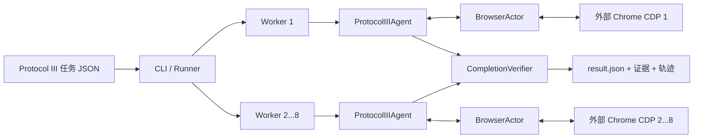

# WebDeepRetriever

WebDeepRetriever 是一套可审计、可并发、可验证完成状态的网页智能体。它通过 Playwright 连接外部 Chrome DevTools Protocol（CDP）浏览器，使用 OpenAI 兼容模型完成网页操作，并以 DOM/无障碍树、浏览器触发的网络响应、文档内容、局部视觉结果和动作回执作为答案证据。

项目默认运行链路位于 `src/web_agent/`，包含浏览器观察与操作、模型工具循环、完成验证、多进程任务调度和离线结果评测。

## 核心能力

- 通过 Playwright `connect_over_cdp()` 连接 1 到 8 个相互独立的外部浏览器。
- 基于 BrowserGym DOM/AX 观察生成稳定 `bid`，使用 Locator 执行点击、填写、选择、滚动、上传、下载和标签页操作，不提供坐标点击入口。
- 采集页面结构、浏览器真实触发的有界 XHR/Fetch、下载文档和动作回执；只有结构化信息不足时才允许局部视觉降级。
- 由 `CompletionVerifier` 校验答案非空、证据引用、字段绑定、表单确认和全量任务覆盖证明；只有完成契约通过验证的 `finish` 才会产生 `SUCCESS`。
- 每个任务采用“基础 30 次模型请求 + 可证明进展信用”的自适应预算，绝对上限 60；用户配置的 100 步仍作为外层安全配置，模型请求零重试。
- 统一进展账本检测周期 1 到 4 的状态/动作循环，并熔断重复 finish、extract、recall 和同 URL 新标签；`extract_many` 可在一次请求内顺序完成最多 8 项同页提取。
- 提供 Protocol III 数据剖析、确定性分层抽样，以及 exact/normalized 离线答案对比。
- 对 URL、凭据、错误和网络证据进行有界记录与脱敏。

## 整体架构



运行时职责：

| 模块 | 职责 |
| --- | --- |
| `src/web_agent/cli.py` | 命令行参数、环境变量和健康检查入口 |
| `src/web_agent/runner.py` | 多进程分片、每个 CDP 一个 Worker、断点续跑和结果汇总 |
| `src/web_agent/runtime.py` | 模型工具循环、工作记忆 checkpoint、进展账本、自适应预算和完成协议 |
| `src/web_agent/browser_actor.py` | CDP 连接、DOM/AX 观察、页面动作、网络/文档/视觉证据和审计产物 |
| `src/web_agent/contracts.py` | 任务契约、动作回执、证据引用和覆盖证书 |
| `src/web_agent/verifier.py` | 完成条件与证据一致性验证 |
| `src/web_agent/protocol3_eval.py` | 数据剖析、分层抽样和离线答案对比 |
| `src/web_agent/sanitization.py` | URL、密钥、错误、请求和响应脱敏 |

## 项目结构

```text
WebDeepRetriever/
├── src/web_agent/                 # 当前默认 Protocol III 实现
├── tests/                         # 单元测试与真实 Chrome/CDP 集成测试
├── vendor/browsergym/             # 固定版本的 BrowserGym DOM/AX 观察依赖
├── data/example_tasks.json        # 最小任务示例
├── evaluation/                    # 评测样本、报告和对比结果
├── scripts/run_agent.sh           # 本地运行脚本
├── Dockerfile
├── docker-compose.yml
├── DEPLOYMENT.md                  # 完整部署说明
├── MANUAL_TESTING.md              # 本地与真实浏览器验收说明
└── ACCEPTANCE.md                  # 已执行验收记录
```

## 环境要求

- Python 3.10 或更高版本。
- 一个已安装并可单独启动的 Chrome/Chromium 浏览器，或比赛方提供的外部 CDP 地址。
- 可用的 OpenAI 兼容 Chat Completions API、支持工具调用的模型和 API Key；使用视觉降级时模型还需支持图像输入。
- 扫描 PDF 视觉降级需要 Poppler；Docker 镜像已安装 `poppler-utils`。
- Docker 部署需要 Docker Engine 与 Docker Compose v2。

正式 Agent 仅允许通过 Playwright 操作网页。项目不需要执行 `playwright install`，正式 Docker 镜像也不会下载、安装或启动浏览器。

## 本地安装

```bash
cd WebDeepRetriever
python3 -m venv .venv
.venv/bin/python -m pip install -e '.[test]'
```

安装后可使用两个控制台命令：

- `webdeepretriever`：运行 Agent。
- `webdeepretriever-eval`：执行 Protocol III 离线评测工具。

也可使用等价模块入口 `python -m web_agent.cli` 和 `python -m web_agent.protocol3_eval`。

## 启动外部浏览器

每个 Worker 必须使用独立端口和独立用户目录。下面的命令只启动本地浏览器，不会主动访问目标网站。

macOS：

```bash
/Applications/Google\ Chrome.app/Contents/MacOS/Google\ Chrome \
  --remote-debugging-address=127.0.0.1 \
  --remote-debugging-port=9222 \
  --user-data-dir=/tmp/webdeepretriever-chrome-9222 \
  --no-first-run about:blank
```

Linux：

```bash
google-chrome \
  --remote-debugging-address=127.0.0.1 \
  --remote-debugging-port=9222 \
  --user-data-dir=/tmp/webdeepretriever-chrome-9222 \
  --no-first-run about:blank
```

可以用项目实际使用的 Playwright 传输验证连接：

```bash
.venv/bin/python - <<'PY'
from playwright.sync_api import sync_playwright

with sync_playwright() as p:
    browser = p.chromium.connect_over_cdp("http://127.0.0.1:9222")
    print({"connected": browser.is_connected(), "contexts": len(browser.contexts)})
PY
```

容器连接宿主机 Chrome 时，浏览器需监听容器可达地址，并通过防火墙限制调试端口的访问范围。生产环境应直接使用受控的比赛方或基础设施 CDP 地址。

## 配置

先复制配置模板：

```bash
cp .env.example .env
```

| 环境变量 | 必填 | 说明 |
| --- | --- | --- |
| `OPENAI_API_KEY` | 是 | 模型 API 密钥 |
| `OPENAI_BASE_URL` | 否 | OpenAI 兼容 API 地址，默认 `https://api.openai.com/v1` |
| `WEBRETRIEVER_MODEL` | 否 | 模型名称，默认 `gpt-4.1-mini` |
| `MOONSHOT_TPM_LIMIT` | 否 | `kimi-k2.6` 组织级 TPM 上限，默认 `3000000` |
| `MOONSHOT_TPM_SAFETY_RATIO` | 否 | `kimi-k2.6` 跨 Worker 预发送安全比例，默认 `0.8` |
| `WEBRETRIEVER_CDP_URLS` | 是 | 1 到 8 个互不相同的 CDP URL，以英文逗号分隔 |
| `WEBRETRIEVER_MAX_STEPS` | 否 | 外层单任务安全配置，允许 1 到 100；实际模型请求由自适应预算控制且不超过 60 |
| `WEBRETRIEVER_WORKER_WATCHDOG_SECONDS` | 否 | Worker 无模型/工具/任务进度后的父进程超时，默认 `900` 秒 |
| `WEBRETRIEVER_UPLOAD_ROOTS` | 否 | 允许上传的目录白名单 |
| `WEBRETRIEVER_INPUT_HOST` | Compose 必填 | 宿主机任务 JSON 路径 |
| `WEBRETRIEVER_OUTPUT_HOST` | 否 | Compose 宿主机输出目录，默认 `./output` |

不要把真实密钥或带凭据的 CDP URL 提交到仓库。

## 运行 Agent

直接使用 CLI：

```bash
OPENAI_API_KEY='替换为实际密钥' \
.venv/bin/python -m web_agent.cli \
  --input data/example_tasks.json \
  --output output \
  --cdp_url http://127.0.0.1:9222 \
  --model gpt-4.1-mini \
  --api_base https://api.openai.com/v1 \
  --max_steps 100
```

或使用环境变量与启动脚本：

```bash
export OPENAI_API_KEY='替换为实际密钥'
export OPENAI_BASE_URL='https://api.openai.com/v1'
export WEBRETRIEVER_MODEL='gpt-4.1-mini'
export WEBRETRIEVER_CDP_URLS='http://127.0.0.1:9222'
bash scripts/run_agent.sh
```

并发数由 CDP URL 数量决定，上限为 8。Runner 会把待执行任务分片到独立进程；多个 Worker 复用同一 CDP URL 会直接报错。`kimi-k2.6` 的所有 Worker 共享同一滑动 TPM 窗口和按通道校准样本：冷启动按真实运行高分位保守预约，usage 返回后用实际输入 token 原子 reconcile；达到安全线时会在发送前等待，该等待不属于 API 重试，OpenAI 客户端仍保持 `max_retries=0`。

每次运行会原子写入 `run_manifest.json`，指纹覆盖数据集、Git/源码、模型/provider、Prompt、工具 Schema、Worker 数、`max_steps` 和 watchdog。普通续跑沿用匹配 manifest 的 `run_id`，且只复用 fingerprint、`run_id` 均一致、`SUCCESS` 且答案非空的结果；旧产物或损坏/缺失 manifest 不会静默复用。使用 `--force_rerun` 可生成新 `run_id` 并强制重跑。

watchdog 能确认 Worker 已终止时会写稳定失败 `result.json`；若进程拒绝 terminate/kill，则父进程改写独占的 `watchdog_failure.json`，避免与迟到 Worker 竞争覆盖同一结果。匹配当前 run 的该标记优先于迟到 `result.json`，续跑不会将其当作成功复用。

`--preflight` 会在零模型请求、零目标导航下检查所有 CDP Worker 的 Browser/Context/Page、DOM/AX/CDP 能力一致性及输出目录原子写入能力；`--healthcheck` 是兼容别名：

```bash
.venv/bin/python -m web_agent.cli \
  --preflight \
  --output output \
  --cdp_url http://127.0.0.1:9222
```

成功时返回 `status: "ok"`、`code: "PREFLIGHT_OK"` 和能力清单；失败时返回稳定错误码、脱敏诊断和非零退出状态。正常批任务启动前也会执行同一 preflight。

## Docker Compose 部署

Docker 镜像只包含 Agent 和 Playwright 客户端，浏览器必须在容器外部运行。

```bash
cp .env.example .env
# 填写 .env 中的模型、CDP、输入和输出配置
docker compose up --build --abort-on-container-exit
```

Compose 将单个任务 JSON 只读挂载到 `/work/input/tasks.json`，结果持久化到 `/work/output`。容器以 UID/GID `10001:10001` 运行，启动前需确保宿主机输出目录可写。

macOS/Windows 的宿主机 CDP 通常填写 `http://host.docker.internal:9222`；Linux Compose 已配置 `host-gateway`。远程或比赛环境应填写实际受控 CDP URL。

本地 CLI 可让 Chrome 仅监听 `127.0.0.1`；容器联调不能使用这个监听地址。容器需要访问宿主机 Chrome 时，应在前述启动命令中改用以下参数，并通过防火墙把 9222 端口限制在本机和容器网段：

```text
--remote-debugging-address=0.0.0.0
--remote-allow-origins=*
```

镜像自检：

```bash
docker build -t webdeepretriever:protocol3 .
docker run --rm \
  -e WEBRETRIEVER_CDP_URLS=http://host.docker.internal:9222 \
  webdeepretriever:protocol3 --healthcheck --output /work/output
```

更多网络边界、直接运行容器和运维说明见 [DEPLOYMENT.md](DEPLOYMENT.md)。

## 输入格式

运行输入必须是 JSON 数组。每条任务使用以下字段；离线标准数据可以额外包含 `answer`：

```json
[
  {
    "task_idx": 0,
    "task_id": "example-task-id",
    "website": "https://example.com",
    "task": "读取页面中的目标信息并返回答案",
    "requires_form_confirmation": false
  }
]
```

`requires_form_confirmation` 只接受显式布尔值；字段缺失默认 `false`。只有任务确实要求提交、发送、创建等副作用并需要确认回执时才设为 `true`，不会从任务自然语言关键词推断。

Runner 使用 `<task_idx>_<task_id>` 作为任务目录名，因此生成后的目录名必须唯一。当前代码不会清理标识符，输入方还必须确保 `task_idx` 和 `task_id` 不包含 `/`、`\`、`..` 等路径片段。仓库中的 [data/example_tasks.json](data/example_tasks.json) 可直接作为结构参考；其中任务会访问真实网站，运行前仍需确认访问权限、登录状态和模型额度。完整任务数据需要按实际运行环境准备。

## 输出与成功口径

每个任务输出到 `<task_idx>_<task_id>/`：

```text
output/
├── <task_idx>_<task_id>/
│   ├── result.json
│   ├── evidence.json
│   ├── capture.json
│   ├── trajectory/
│   ├── trajectory_visual/
│   ├── observations/
│   └── downloads/
└── logs/
    ├── worker_<id>.log
    └── summary.json
```

`result.json` 保存 `agent_answer`、状态、动作、进展原因、访问 URL、动作回执、证据绑定、服务端覆盖证书和逐请求 `model_usage`。模型只接触 `record_coverage` 返回的短 `coverage_id`。`logs/summary.json` 汇总请求数、任务耗时、实际输入 token 的 p50/p95/max，以及预发送等待与限流原因；逐请求记录上下文字节分类、语义状态、缓存/循环计数和模型/工具/浏览器延迟，且不包含提示词正文、密钥或请求 ID。`capture.json` 记录本任务所有已附加页面通过浏览器触发的有界 XHR/Fetch，并对敏感字段脱敏。

主要状态：

| 状态 | 含义 |
| --- | --- |
| `SUCCESS` | `finish` 已通过完成契约和证据结构验证；不代表答案语义正确 |
| `FAIL_MAX_STEPS` | 达到 60 次绝对模型请求上限且没有通过验证的 `finish` |
| `FAIL_NO_PROGRESS` | 重复调用、周期循环、无新信息或自适应预算耗尽，保护在下一次模型请求前终止任务 |
| `FAIL_UNVERIFIED_FINISH` | Agent 结束，但没有获得验证通过的 `finish` |
| `FAIL_AGENT_ERROR` | 模型调用或 Agent 工具循环失败 |
| `FAIL_BROWSER_ERROR` | CDP 连接、任务页面初始化等浏览器启动阶段失败 |

进程正常退出不等于任务成功，`SUCCESS` 也不等于答案正确。答案正确率仍需通过标准答案的 exact/normalized 离线对比确定；离线评测只应读取真实落盘结果并保留失败状态。

## Protocol III 离线评测

数据剖析：

```bash
.venv/bin/python -m web_agent.protocol3_eval profile \
  --input /path/to/protocol3.json \
  --output /tmp/protocol3.profile.json
```

生成确定性分层样本：

```bash
.venv/bin/python -m web_agent.protocol3_eval sample \
  --input /path/to/protocol3.json \
  --output /tmp/protocol3.sample.json \
  --report /tmp/protocol3.sample.report.json \
  --size 8 \
  --seed 20260726
```

对比已经落盘的结果：

```bash
.venv/bin/python -m web_agent.protocol3_eval compare \
  --input /path/to/protocol3.json \
  --results /path/to/output \
  --unrun-reasons /path/to/unrun-reasons.json \
  --output /tmp/protocol3.comparison.json \
  --csv /tmp/protocol3.comparison.csv
```

报告会分别统计 `executed_tasks`、`successful_results`、`comparable_tasks`、exact 和 normalized。normalized 仅执行 Unicode NFKC、大小写与空白规范化，不改变列表顺序或数值类型。未运行、运行失败、成功但无可比较答案必须分别报告，不能用离线数据剖析代替真实端到端成绩。

固定 8 条 Kimi K2.6 真实运行的事实记录见 [evaluation/KIMI_K2_6_REAL_TEST_20260726.md](evaluation/KIMI_K2_6_REAL_TEST_20260726.md)。该次结果为 0 条可比较答案：7 条受 Moonshot 组织级 3,000,000 TPM 配额限制，1 条在 SEC 站点受限后耗尽 100 步。因此它既不能外推为 100 条总体准确率，也不能单独解释为模型语义能力结论。

## 测试与验收

无需 Chrome 的单元测试：

```bash
.venv/bin/python -m pytest -q -m 'not integration'
```

完整单元测试与真实 Chrome/CDP 集成测试：

```bash
WEB_AGENT_REQUIRE_CHROME=1 .venv/bin/python -m pytest -q
```

浏览器集成测试覆盖 DOM/AX、iframe、开放 Shadow DOM、SPA、分页、虚拟列表、局部视觉、弹窗、标签页、上传下载、PDF、浏览器网络证据与线程亲和性。详细验收步骤见 [MANUAL_TESTING.md](MANUAL_TESTING.md)，历史执行记录见 [ACCEPTANCE.md](ACCEPTANCE.md) 和 [Kimi K2.6 真实测试记录](evaluation/KIMI_K2_6_REAL_TEST_20260726.md)。

## 已知限制与安全边界

- 真实站点的登录、区域限制、反自动化、限流和临时不可用会直接影响任务结果，必须逐任务记录，不能归因成统一的模型准确率。
- 每个 Worker 需要独立浏览器状态；并发数还必须服从模型服务的 RPM/TPM 配额。
- closed Shadow DOM 无法通过页面标准 DOM 接口遍历；Canvas、图片、图表和扫描 PDF 只提供受限的局部视觉降级。
- 全量任务依赖可验证的分页、游标、虚拟列表终止条件或页面声明总数；无法证明覆盖时不会返回 `SUCCESS`。
- CDP URL 可能包含访问凭据，调试端口等同于浏览器控制权限，不应暴露到公网。
- 默认执行链路只通过 Playwright 与受控浏览器交互，不使用外部搜索引擎、裸 CDP 客户端，也不通过主动网站 HTTP/API 请求绕过浏览器交互。

## 第三方依赖与许可

项目 vendoring 的 BrowserGym 来源、版本和文件校验记录见 [vendor/browsergym/SOURCE.md](vendor/browsergym/SOURCE.md)，其许可证见 [vendor/browsergym/LICENSE](vendor/browsergym/LICENSE)。完整第三方声明见 [THIRD_PARTY_NOTICES.md](THIRD_PARTY_NOTICES.md)。

仓库当前未包含项目自身的顶层许可证文件；对外发布或分发前应先补充明确的授权条款。
